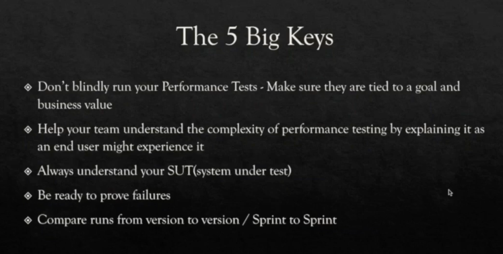

## coaching QA on writing BDD test scenarios
- My journey to coach QA automation 

to write good BDD test scenarios

## on performance testing
- Failure to communicate effectively 

Miscommunication between the product team, business and delivery team 

can hamper the quality of the product deliver to the end user

- Chaos monkey - great step to resilience engineering

Start hitting the red button

Start taking your database down

Performance tools 

Blaze meter

JMeter

Locust - python-based tool

