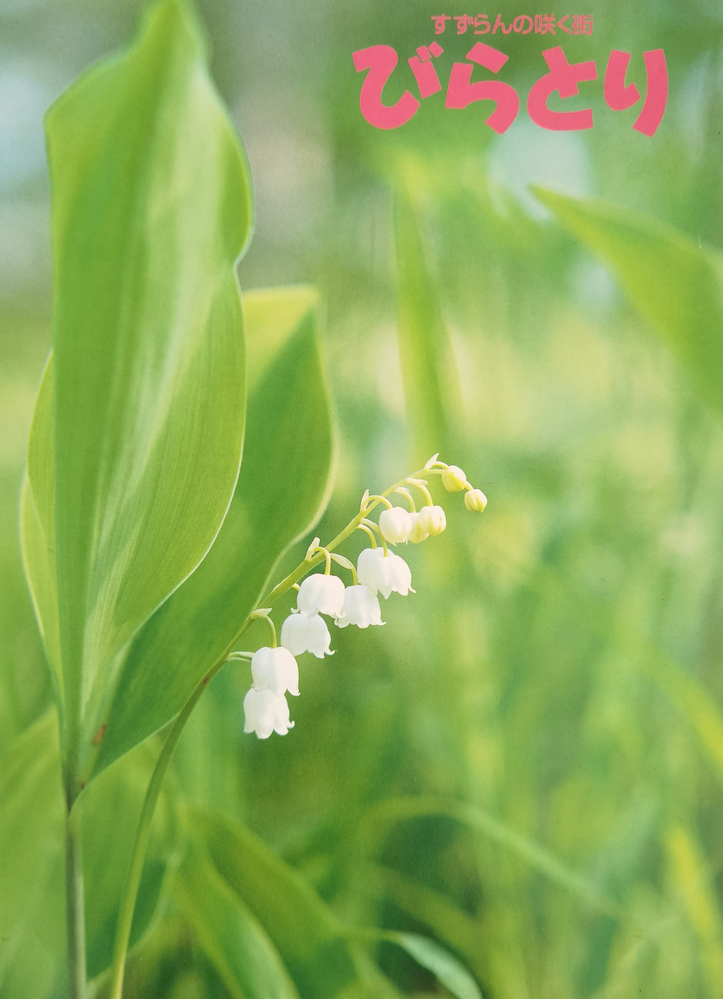
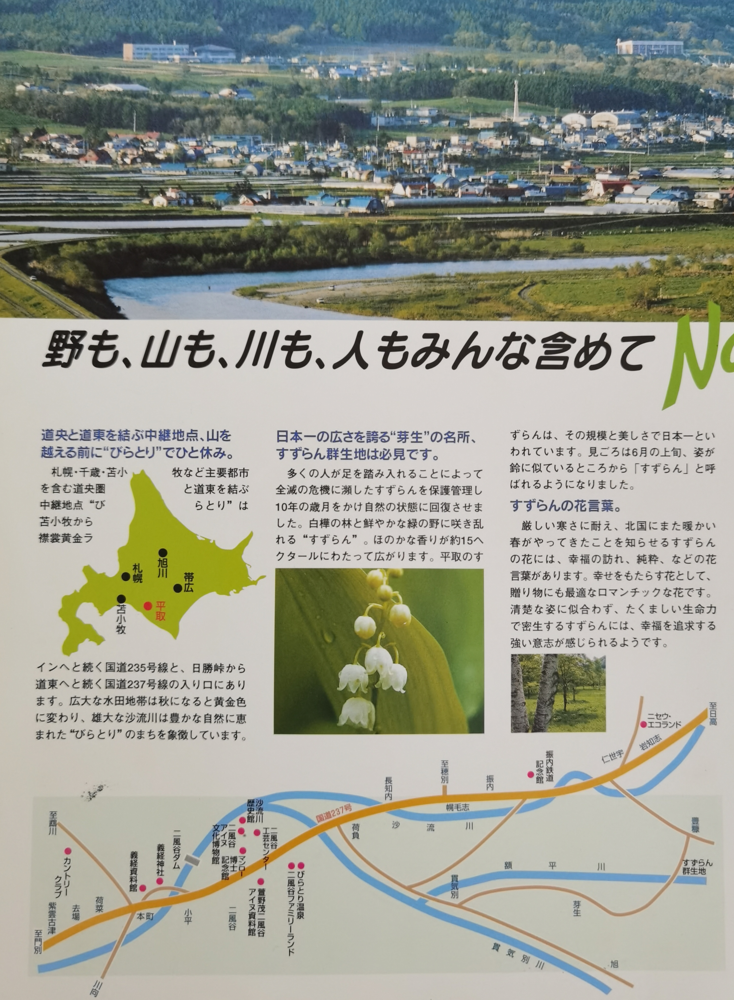

## Lily of the Valley called スズラン (Suzuran) in Japanese
- My favourite flower - Lily of the valley 
🌼 🌼 🌼 🌼 🌼 🌼 🌼 🌼 🌼 🌼 🌼 
I was told this flower can heal from poisonous snake bite

🌸🌸🌸🌸🌸🌸🌸🌸🌸🌸🌸🌸🌸🌸🌸🌸🌸🌸🌸🌸🌸🌸🌸🌸🌸🌸
- A colony of lily of the valley in Biratori a town in Hokkaido 

