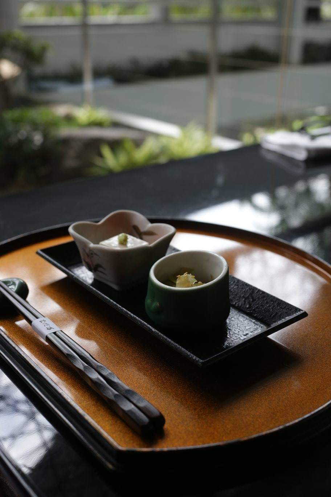
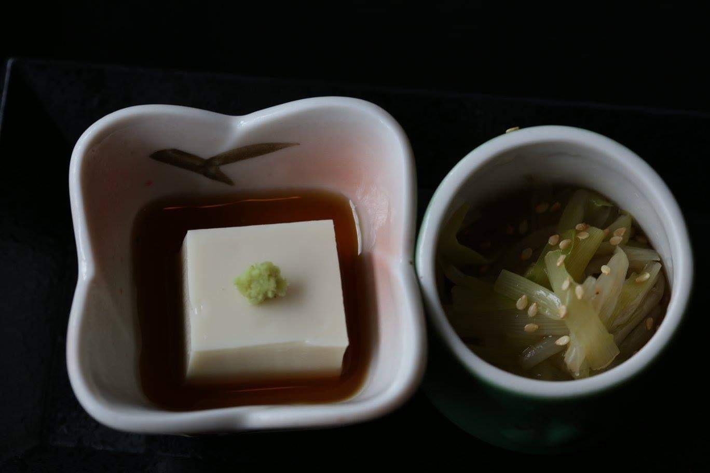
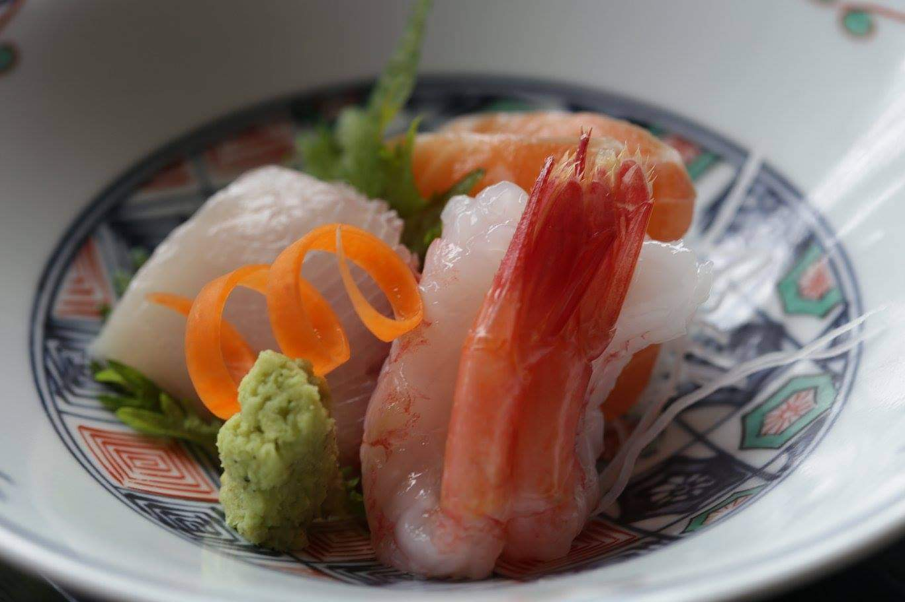
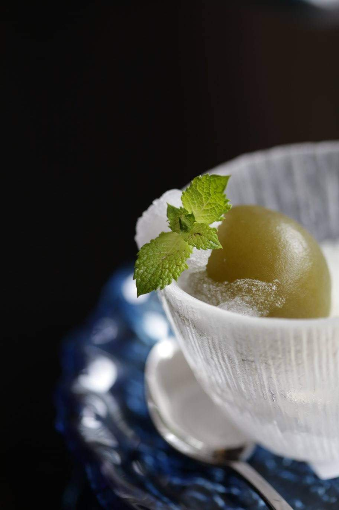

Japanese lunch set at Nadaman restaurant using my credit card voucher
turn out to be my last visit in july 2016 which will be closing down in Oct for renovation 

## I love the food arrangement
- Hiru kaiseki and Nagomi Zen Lunch Set 
from an angle

from topview

raw seafood

ume dessert 👍👍👍

