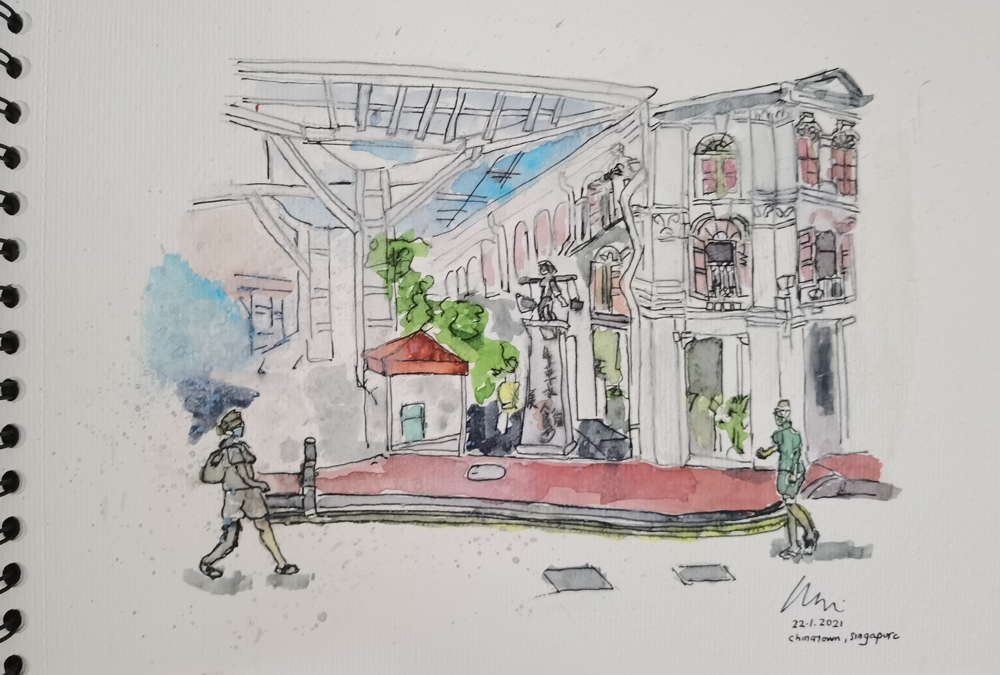
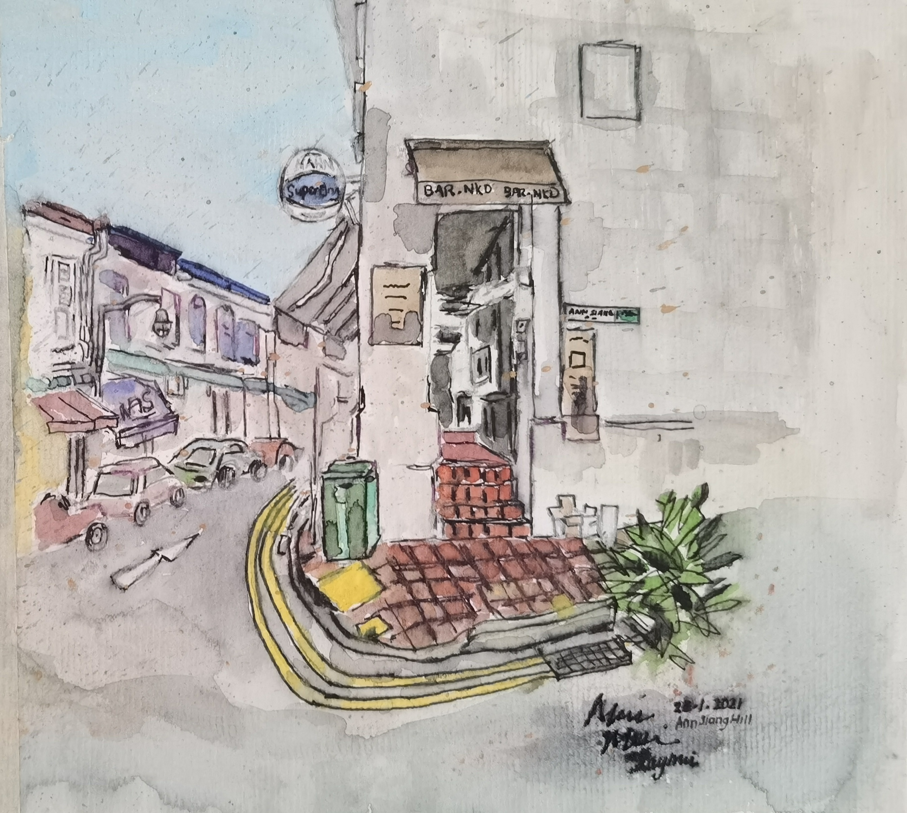
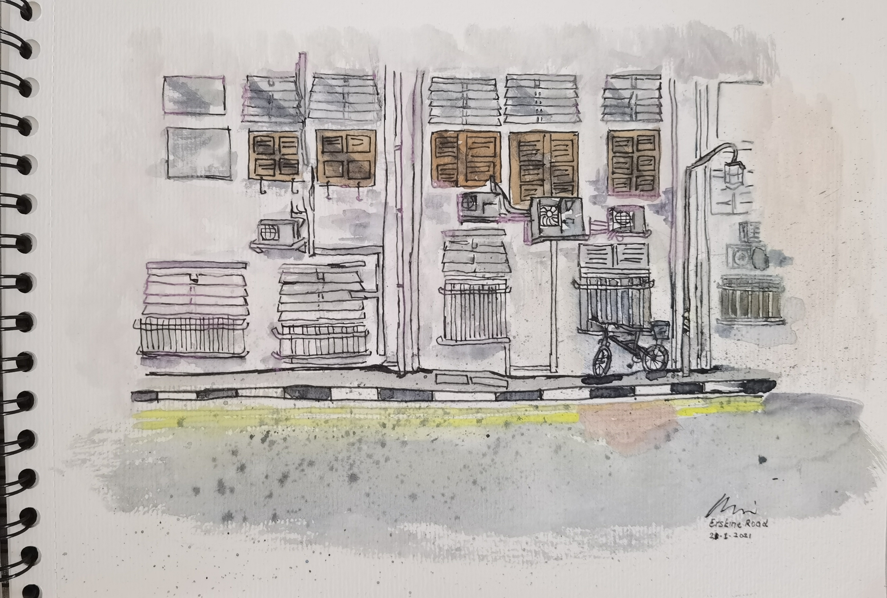

## Collection of Art Work at Chinatown
- The People Park Building

- The food street at Smith Street

- Up the slope of Ann Siang Hill and Club street

- Corner of Ann Siang Hill to Club street

- used to be a hospital opposite scarlet hotel at Erskine road

