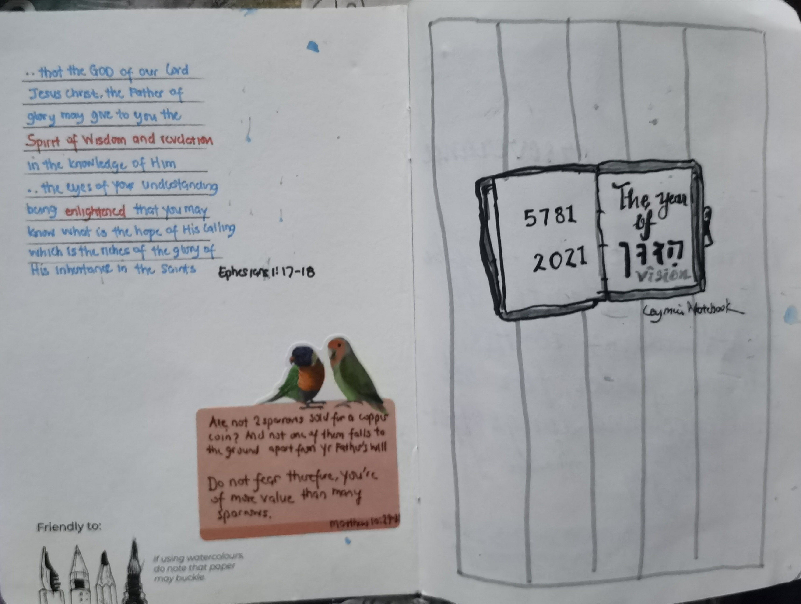

**Spiritual Art Journal** is a A6 blog using Gridsome, inspired by the design of the [Attila](https://github.com/zutrinken/attila) Ghost theme, and styled with [Tailwind CSS](https://tailwindcss.com).

<!-- [Gridsome](https://gridsome.org) is a Vue.js-powered, modern site generator for building the fastest possible websites for any Headless CMS, APIs or Markdown-files. Gridsome makes it easy and fun for developers to create fast, beautiful websites without needing to become a performance expert. -->

## Features
- The Year of Hazon Vision - Ephesians 1:17-18

- Perserverance and the Lord's Prayer

